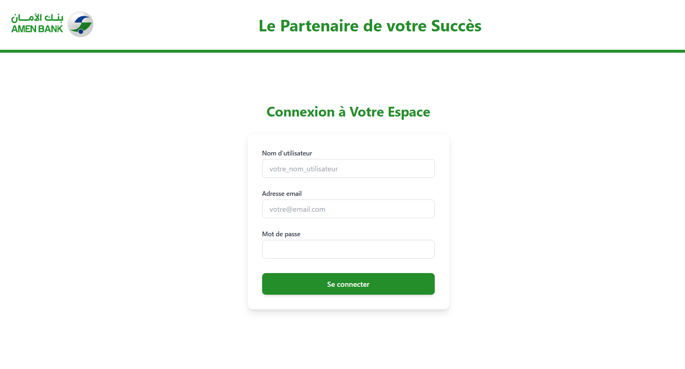
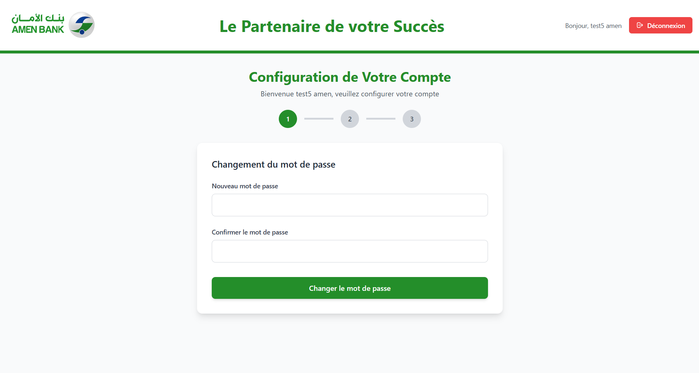
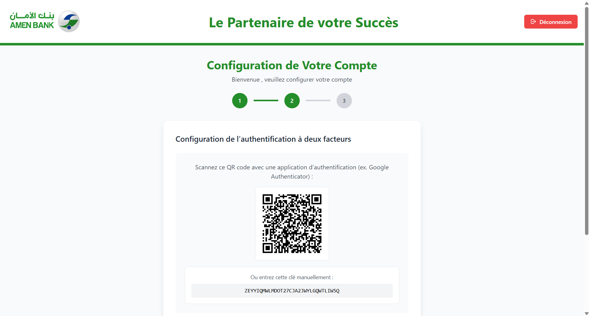
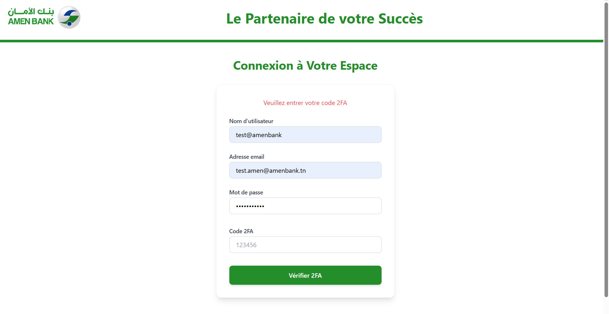
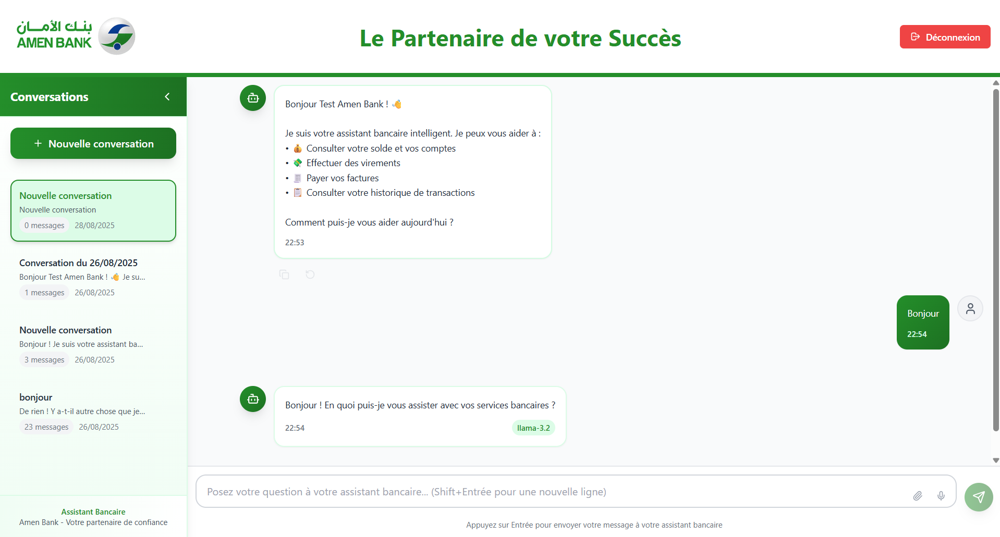

# 🏦 Secure Banking Chatbot — Intelligent Web Application for Online Banking Services

## 🎯 Project Objective
This project aims to modernize online banking by developing an intelligent and secure **web application** that integrates a **conversational AI chatbot**.  
The chatbot acts as a **virtual banking assistant**, providing users with quick access to essential services such as account balance consultation, transaction history, fund transfers, and bill payments — all within a secure and user-friendly interface.

The main objective is to deliver a **personalized, fast, and secure digital banking experience**, leveraging **AI**, **Natural Language Processing (NLP)**, and **strong authentication mechanisms** (2FA).  

---
## ⚙️ Overall Architecture
The architecture of the project is based on a **client-server model** integrating both **backend** and **frontend pipelines** to ensure scalability, modularity, and security.  

It is divided into two primary layers:

- **Backend Layer (Django + REST API):** Manages users, authentication, financial transactions, and AI-based chatbot logic.  
- **Frontend Layer (React + Tailwind CSS):** Handles user interaction, chatbot conversations, and real-time display of data.  

Both layers communicate through a **secure REST API** and use **PostgreSQL** for data storage.

---
### 🧩 Architecture Overview

#### Backend — Core Services
The backend, built with **Django** and **Django REST Framework**, is responsible for:
- **User Management & Authentication:** Secure login and registration system with Two-Factor Authentication (2FA) using TOTP and JWT tokens.  
- **Business Logic:** Execution of payments, transfers, and transaction queries.  
- **Chatbot Engine:** Powered by **LangChain** and **LLaMA 3 (2B)** for understanding natural language and generating accurate responses.  
- **RAG Integration:** Retrieves contextual banking information from a structured JSON database.  
- **Data Persistence:** Ensures data integrity through ACID transactions using **PostgreSQL**.  

#### Frontend — User Interface
The frontend, developed with **React.js** and styled using **Tailwind CSS**, provides:
- An intuitive **login interface** with password reset and 2FA verification.  
- A **chat window** enabling real-time communication with the banking assistant.  
- Responsive layouts for desktop, tablet, and mobile devices.  
- Secure session handling and token management.  

---
## 🔐 Security and Authentication Pipeline

### Step 1 — User Login
The user logs in using their username, email, and password. The credentials are validated via the Django REST API.




### Step 2 — Password Update (First Login)
On first login, the user is prompted to change their temporary password.



### Step 3 — Two-Factor Authentication (2FA)
A **QR code** is generated to set up **Google Authenticator**. The user scans it and provides a one-time code to activate 2FA.



### Step 4 — Login with 2FA (Second Login)
After setting up two-factor authentication, the next login requires the user to enter their **6-digit code** from Google Authenticator in addition to their credentials.



### Step 5 — Session Management
Once authenticated, the user’s session is maintained using **JWT tokens**, with automatic expiration and refresh handling for enhanced security.

---

## 💬 Chatbot Interface

After successful authentication, the user is redirected to the **Chatbot Dashboard**, which allows real-time interaction with the banking assistant.  
The chatbot processes user queries and provides relevant responses instantly.



---
## 🗄️ Database Schema

The PostgreSQL database is composed of the following main tables:
- **Client:** Stores user data, authentication secrets, and preferences.  
- **BankAccount:** Manages account types, balances, and currencies.  
- **Transaction:** Tracks all operations (deposits, withdrawals, transfers).  
- **ChatConversation & ChatMessage:** Log chatbot interactions for analytics and traceability.  

---
## 🧰 Technologies and Frameworks

| Layer | Tools & Frameworks |
|--------|--------------------|
| **Backend** | Django, Django REST Framework |
| **Frontend** | React JS, Tailwind CSS |
| **Database** | PostgreSQL |
| **AI/NLP** | LangChain, LLaMA 3 (2B), RAG |
| **Security** | JWT, 2FA (TOTP), PBKDF2 |
| **Utilities** | PyOTP, qrcode, django-cors-headers |

## ⚙️ Setup and Running Instructions

This section explains how to set up and run the **Chatbot Bank** project on your local environment.

### 🧩 1. Clone the Repository

First, clone the repository from GitHub and move into the project folder:

```bash
git clone https://github.com/MolkaSahli/Chatbot-Bank.git
cd Chatbot-Bank
```

---
### 🏗️ 2. Backend Setup (Django API)

#### a. Create and activate a virtual environment

```bash
# Create the virtual environment
python -m venv venv
# Activate it
venv\Scripts\activate
```

#### b. Install dependencies
```bash
pip install -r requirements.txt
```

#### c. Apply database migrations
```bash
python manage.py makemigrations
python manage.py migrate
```

#### d. Create a superuser
```bash
python manage.py createsuperuser
```
#### e. Run the backend server
```bash
python manage.py runserver
```
---
### 💻 3. Frontend Setup (React Application)
In a new terminal window:
```bash
cd frontend
npm install
npm start
```
Your frontend interface will be available at:
👉 http://localhost:3000